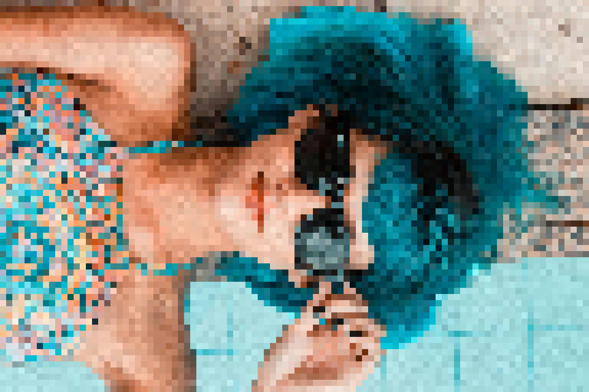
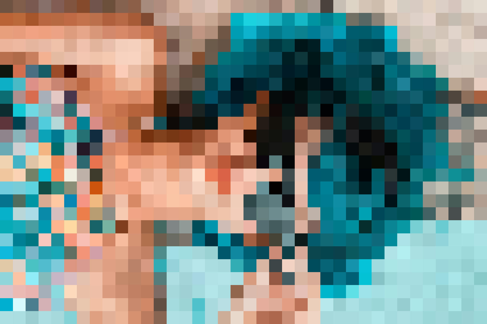

# Pixelize [](https://crates.io/crates/pixelize)

This crate provides a CLI tool to pixelate your supplied image.

## Installation

```
cargo install pixelize
```

## Usage

```
pixelize -i girl.jpg -o girl_10.jpg -d 10
```

| Original              | -d 10                         |
| --------------------- | ----------------------------- |
|  |  |

| -d 20                         | -d 50                       |
| ----------------------------- | --------------------------- |
|  |  |
